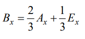

# Aufgabe 4: Koch-Kurve (Java)

Einsendeaufgabencode: B-GOPB01-XX2-K04  
Bearbeiter: Maxim Heibach  
Matrikelnummer: 909442

## Aufgabe
Die Koch-Kurve ist eine fraktale Struktur, die ausgehend von einem Polygon mit n Eckpunkten jedes durch die beiden Punkte Pi und P((i+1) mod n) definierte Linienstück („mod“ meint den Modulo-Operator) in vier kürzere Linienstücke unterteilt. Jedes entstehende Linienstück besitzt 1/3 der Länge des ursprünglichen Linienstücks.  

Die Abbildung zeigt ein Beispielpolygon sowie verschiedene Unterteilungsstufen der entstehenden Koch-Kurven.


In dieser Aufgabe sollen Sie schrittweise eine Visualisierung von Koch-Kurven in Java implementieren.

1. Implementieren Sie eine von *JFrame* abgeleitete Klasse mit einem inneren *JPanel*. Die Größe des Frame bzw. Panel können Sie beliebig wählen. Zeichnen Sie in das Fenster sodann ein Polygon.  

    Hinweise: Sie können zur Lösung der Aufgabe die Klasse *java.awt.Polygon* verwenden. Die Eckpunkte des Ausgangspolygons können Sie beliebig wählen. Im Beispiel verwenden wir ein Dreieck mit den Punkten  
p0=(250,50)  
p1=(400,350)  
p2 = (100,350)

2. Implementieren Sie eine statische Methode  
*static Polygon subdivide(Polygon polygon)*  
die einen Unterteilungsschritt ausführt (das heißt, *subdivide* liefert für das Polygon in a) das Polygon in b) zurück).  

    Betrachten Sie hierzu die aus Wikipedia übernommene Abbildung für die Unterteilung eines Linienstücks AE: 
    
    
    
    Die x-Koordinate des Punkts B in der Abbildung ergibt sich durch eine Linearkombination der x-Koordinaten der beiden Punkte A und E:

    

    Analog für die y-Koordinate:

    

    Für den Punkt D verwenden Sie die Faktoren 1/3 und 2/3.

    Sie erhalten den zu der Linie AE senkrechten Vektor, indem Sie die x- und y-Koordinate vertauschen und das Vorzeichen von x negieren: (y, – x). Diesen Vektor müssen Sie normieren, das heißt auf die Länge 1 bringen. Die Länge l eines Vektors mit Koordinaten (x,y) bestimmt sich durch 
    
    l = sqrt(x²+y²)

    Teilen Sie den zu AE senkrechten Vektor komponentenweise durch seine Länge. Nennen wir diesen normierten Vektor n (n zeigt in Richtung d).

    Die Längen von b und e sind bekannt (1/3 der Länge von AE bzw. 1/6 der Länge von AE). Bestimmen Sie anhand des Satzes von Pythagoras die Länge von d (es gilt b² = e² + d²).

    Den Punkt C erhalten Sie, indem Sie den (normierten!) Vektor n, skaliert mit der Länge von d, komponentenweise auf den Mittelpunkt pM addieren. Gehen Sie nun für jedes Eckpunktepaar P(i), P((i+1) mod n) des Polygons wie folgt vor:  
    1. übernehmen Sie den Punkt pi in das neue Polygon  
    2. übernehmen Sie den Punkt B in das neue Polygon  
    3. übernehmen Sie den Punkt C in das neue Polygon  
    4. übernehmen Sie den Punkt D in das neue Polygon  

    Sie benötigen die Polygon-Eigenschaften xpoints, ypoints und npoints sowie die Polygon-Methode addPoint. Beachten Sie, dass addPoint ganzzahlige Koordinaten erwartet; Sie müssen die Fließkommawerte der berechneten Punkte somit in int casten. Bei der Berechnung der neuen Punkte B, C und D müssen Sie umgekehrt die ganzzahligen Polygon-Koordinaten in Fließkommawerte wandeln.

    Wenn es Ihnen hilft, können Sie die folgende Klasse Vector2 verwenden und ggf. weitere Methoden in dieser Klasse ergänzen:

    ```sh
    public class Vector2 {
        public final double x;
        public final double y;
        public Vector2(double x, double y) {
            this.x = x; this.y = y;
        }
        public double length() {
            return Math.sqrt(x*x + y*y);
        }
        public Vector2 normalized() {
            double len = length();
            return new Vector2(x/len, y/len);
        }
        public Vector2 linearInterpolation(Vector2 other, double t) {
            return new Vector2((1-t)*x + t*other.x, (1-t)*y + t*other.y);
        }
    }
    ```

3. Implementieren Sie nun eine Methode  
*static Polygon subdivide(Polygon polygon, int steps)*  
die das übergebene Polygon mittels der Methode *subdivide* aus Aufgabenteil 2 rekursiv oder iterativ unterteilt, bis *steps* gleich 0 ist. Wenn Sie diese Methode beispielsweise für das Polygon aus Abbildung a) und *steps = 2* aufrufen, erhalten Sie das Ergebnis aus Abbildung c).

    Implementieren Sie zudem im Hauptprogramm (main) ein Auslesen der Aufrufparameter (args-Array), so dass die Unterteilungsstufe beim Aufruf des Programms angegeben werden kann:

    ```sh   
    java KochKurve 5
    ```

    Falls kein Parameter übergeben wurde, oder dieser sich nicht in eine ganze Zahl wandeln lässt, verwenden Sie einen beliebigen Standardwert (z.B. 4). Beachten Sie, dass aufgrund von Rundungsfehlern eine höhere Unterteilung als 5 nicht darstellbar ist. 